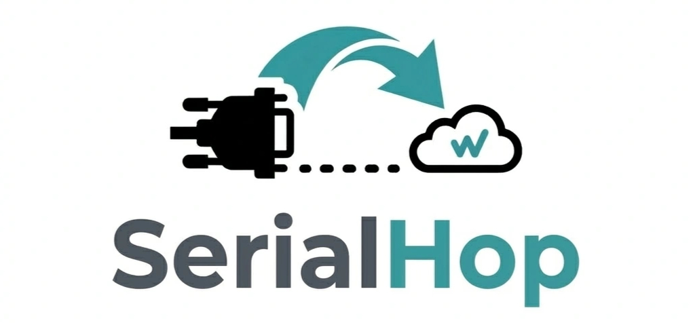
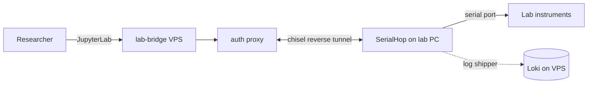
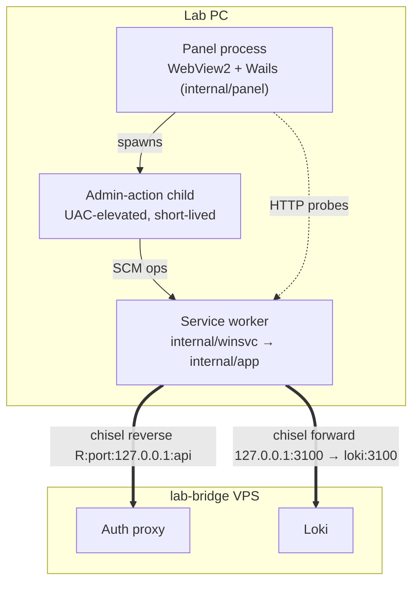

<p align="center">
  
</p>

# SerialHop

The Windows agent for [lab-bridge](https://github.com/bioexperiment-lab-devices/lab-bridge). SerialHop runs on a lab PC, discovers serial-attached instruments (peristaltic pumps, distribution valves, densitometers), and exposes a local REST API to lab-bridge over a chisel reverse tunnel — letting researchers operate those instruments from a shared JupyterLab environment without opening any inbound port on the lab network.

If you have a Windows PC sitting behind NAT with serial-attached lab instruments wired to it, and you'd like a remote JupyterLab session to talk to them, this is what runs on that PC.



## Install

Download `SerialHop-Setup-vX.Y.Z.exe` from the [releases page](https://github.com/bioexperiment-lab-devices/serialhop/releases/latest) (or your lab management UI) and run it.

Silent / scripted install: `SerialHop-Setup.exe --silent --dir "<path>"`. See [`docs/superpowers/specs/2026-05-15-installer-design.md`](docs/superpowers/specs/2026-05-15-installer-design.md) for the full flag set and upgrade/downgrade behavior.

## Control panel — feature tour

The panel is a Wails v2 + React desktop window. It opens by double-clicking `SerialHop.exe` and drives the underlying Windows service. Frameless, responsive (720 px collapse breakpoint), with a sticky titlebar.

### Status

Lamps, service-control buttons, and a keep-awake toggle.

- **Lamps**: Local service (SCM state), Lab-bridge server (reachability + health probe to the configured server), Reverse tunnel (chisel session state from this machine).
- **Service control**: Install / Uninstall / Restart. All three elevate via UAC.
- **Keep-awake toggle**: tells Windows not to idle into sleep or run a scheduled automatic shutdown while it's on. The request is held by the service process and is reflected in `powercfg /requests`; clearing it (or stopping the service) lets normal power management resume.
- When a newer release is available, an **Update** row appears here: download → SHA-256 verify → install with automatic rollback if the service fails to come back up.
- If the panel crashed on its last run, a prior-crash report is surfaced inline.

### Config

Typed editor over `%ProgramData%\SerialHop\SerialHop_config.yaml`. Field-level validation (lab-bridge host as IPv4 or RFC 1123 hostname; integer fields can be cleared). Dirty-state guard on tab switch — switching away with unsaved edits opens a modal listing exactly which fields are dirty. The default save flow is **Save & restart**, so config changes take effect immediately. An **Open config file** button reveals the YAML in Explorer if you need to edit it directly.

Set `auto_update.enabled: false` in the YAML to disable update checks (e.g., on air-gapped lab machines).

See [`docs/configuration.md`](docs/configuration.md) for the full configuration guide: every field, common tasks (rotate credentials, restrict discovery, enable flashing), and when to use the panel vs. editing the YAML directly.

### Devices

Discovered devices with **type** (`pump` / `valve` / `densitometer`), **port**, and connection state. Per-row Disconnect releases that one port without tearing down the rest of the registry.

### Ports

Every enumerated COM port plus its USB descriptor (VID, PID, SerialNumber, Product). A filter box narrows the list.

Raw serial attach (`GET /serial/ports/{port}/attach`, see the REST API table below) isn't a panel feature — it's an operator-gated (`raw_serial.enabled`) WebSocket endpoint available only for ports with no discovered device.

### Logs

Live tail of the structured logs under `%ProgramData%\SerialHop\logs\`. Newest-first ordering, sticky filter bar (level + free-text), inline log-detail view for the structured fields, on-open backlog so you can read what happened before the panel opened. An **Open logs folder** button reveals the directory in Explorer.

## REST API

The REST API is bound to `127.0.0.1` on the lab machine; it is reachable from outside **only** through the chisel reverse tunnel that the lab-bridge auth proxy fronts. All requests and responses are JSON. Infra endpoints report errors as `{ "error": "<short>", "detail": "<long>" }`; device commands use the envelope described below.

| Method | Path | Purpose | Gate |
| --- | --- | --- | --- |
| `POST` | `/api/v1/discover` | Re-probe ports, rebuild device sessions, return the new list | — |
| `GET`  | `/api/v1/devices` | Return the cached device list | — |
| `POST` | `/api/v1/devices/{id}/command` | Execute one JSON protocol command on a device | — |
| `POST` | `/devices/disconnect` | Release all device sessions; with `?port=<name>` release just that one | — |
| `GET`  | `/serial/ports/detailed` | List enumerated COM ports with USB descriptors | — |
| `GET`  | `/serial/ports/{port}/attach` | Raw serial byte + line-control stream (WebSocket), for ports with no discovered device | `raw_serial.enabled` |
| `POST` | `/flash/{port}` | Pre-backup → flash → byte-verify → optional test → auto-rollback | `flashing.enabled` |
| `GET`  | `/agent/info` | Agent self-description for server-pulled state | — |
| `POST` | `/agent/update` | Admin-pushed update: download → SHA-256 verify → install (no operator action) | `remote_update.enabled` |
| `GET`  | `/agent/update/status` | Last push outcome (survives the service restart) | `remote_update.enabled` |
| `GET`  | `/power/keep-awake` | Report keep-awake state | — |
| `POST` | `/power/keep-awake/enable` | Activate keep-awake (idempotent) | — |
| `POST` | `/power/keep-awake/disable` | Clear keep-awake (idempotent) | — |

Device types: `pump` (type code `10`), `valve` (`30`), `densitometer` (`70`). Device IDs are ordinal per type in `(type code, port)` order: `pump_1`, `valve_1`, … Note the valve's hub type name is `valve` while its `identify.device_type` is `distribution_valve`.

<details>
<summary><b>Remote updates (admin push)</b> — <code>POST /agent/update</code>, <code>GET /agent/update/status</code></summary>

A lab-bridge **admin** can push a SerialHop update to a lab PC with no operator action and no UAC prompt. Off by default; enable with `remote_update.enabled: true`. Access is restricted to admins **server-side** (lab-bridge Authelia, the same way `/flash` is) — SerialHop itself does not authenticate the caller, so when the flag is off both endpoints return `404`.

`POST /agent/update` selects the source by body:

| Body | Source |
| --- | --- |
| `{}` (or empty) | latest GitHub release |
| `{"version":"v2.3.0"}` | that GitHub release tag |
| `{"url":"https://…/SerialHop-v2.3.0.exe","sha256":"<hex>"}` | a custom mirror (https only; `sha256` required) |

Downgrade and same-version reinstall are allowed (the admin is authoritative); a GitHub-mode request whose target equals the running version returns `200 {"outcome":"noop"}`. Otherwise the call returns `202 {"accepted":true,"to":"2.3.0"}` immediately and the work happens in the background: the LocalSystem service downloads + SHA-256-verifies the binary, then a **detached** child (inheriting LocalSystem) performs the stop → swap → start with automatic rollback.

Because the install restarts the very service handling the request, the outcome is reported through `GET /agent/update/status`, which survives the restart:

```json
{ "state": "succeeded", "from": "2.2.0", "to": "2.3.0",
  "started_at": "…", "finished_at": "…" }
```

`state` is one of `none | downloading | verifying | installing | succeeded | rolled_back | failed`; `failed`/`rolled_back` carry an `error`. For custom-mirror mode the caller-supplied `sha256` guards transfer integrity only, not provenance — its trust anchor is the admin-only server gate plus the operator's opt-in.

</details>

<details>
<summary><b>Devices &amp; commands</b> — <code>POST /api/v1/discover</code>, <code>GET /api/v1/devices</code>, <code>POST /api/v1/devices/{id}/command</code></summary>

`POST /api/v1/discover` closes every current device session (drivers persist their state), re-probes the candidate ports, and builds fresh sessions. `GET /api/v1/devices` serves the same list from cache.

```json
{
  "devices": [
    {
      "id": "pump_1", "type": "pump", "port": "COM7", "connected": true,
      "identify": {
        "device_type": "pump", "model": "peristaltic-1ch", "serial": "26-025",
        "firmware_version": "legacy", "protocol_version": "1.0", "capabilities": {}
      }
    }
  ],
  "discovered_at": "2026-07-06T12:34:56Z"
}
```

`identify` is `null` until the device's post-probe attach succeeds; a device that probed but failed to attach is listed with `"connected": false` and retried in the background.

`POST /api/v1/devices/{id}/command` executes one command. Body and response are the protocol envelope:

```json
{ "id": "req-1", "cmd": "dispense", "params": { "volume_ml": 5, "speed_pct": 60 } }
```

```json
{ "id": "req-1", "status": "ok", "result": { "job_id": "j-3", "state": "running" } }
```

The per-device command sets (envelope, error codes, job model) are documented canonically in [`docs/protocol_translation_docs/`](docs/protocol_translation_docs/) — one `JSON_PROTOCOL.md` per device type.

HTTP status mirrors the envelope outcome:

- Device-decided outcomes (`ok`, `busy`, `invalid_params`, `not_calibrated`, `not_homed`, `hardware_error`, `unknown_command`, `internal_error`) → **200** with the envelope.
- Unknown device id → **404**, envelope error `unknown_device`.
- Device unreachable → **503**, envelope error `device_unreachable`. Exception: `identify` (served from cache once a first attach has succeeded) and `get_job` (always served from the jobs engine — including a job that just failed with `hardware_error` when the device became unreachable mid-job) stay at **200**.
- Malformed body / missing `id` or `cmd` → **400**, envelope error `invalid_request`.
- `POST /api/v1/discover` while another discovery runs, or while any device has an active job → **409** with `{ "error": "...", "detail": "..." }`; stop jobs first.

</details>

<details>
<summary><b>Disconnect</b> — <code>POST /devices/disconnect[?port=&lt;name&gt;]</code></summary>

Releases device sessions in the registry. Always available — no config gate.

- No query: releases every open device handle.
- `?port=COM3`: releases just the device on `COM3`, leaving the rest of the registry untouched. `404` if no device is registered on that port.

```json
{ "released": 3 }
```

</details>

<details>
<summary><b>Ports</b> — <code>GET /serial/ports/detailed</code></summary>

Always available; this is what the panel's Ports tab uses:

```json
{
  "ports": [
    {
      "name": "COM3", "is_usb": true,
      "vid": "2341", "pid": "0043",
      "serial_number": "85731303530...", "product": "Arduino Uno",
      "discovered": true, "device_id": "pump_1"
    }
  ]
}
```

</details>

<details>
<summary><b>Firmware flashing</b> — <code>POST /flash/{port}</code></summary>

Off by default. Set `flashing.enabled: true` to enable. AVR / optiboot only (Arduino Uno R3 today).

```json
{
  "firmware": ":100000000C9434000C9456000C9456000C94560062\n…:00000001FF\n",
  "test_command": "55 01",
  "expected_response": "AA 01",
  "skip_backup": false
}
```

The response is a multi-stage outcome with a pre-flash backup (saved to disk on the lab machine *and* returned inline), byte-verify, optional test, and auto-rollback on any post-erase failure. `skip_backup: true` shaves ~8 s on a 32 KB sketch but disables rollback.

See [`docs/superpowers/specs/2026-05-12-remote-firmware-flashing-design.md`](docs/superpowers/specs/2026-05-12-remote-firmware-flashing-design.md) for the full request/response shape, the staged-status semantics, and the recovery-hint behavior.

</details>

<details>
<summary><b>Agent info</b> — <code>GET /agent/info</code></summary>

Best-effort self-description for the lab-bridge server to pull. Never fails.

```json
{
  "version": "0.28.0+v0.28.0",
  "build_sha": "v0.28.0",
  "os": "windows",
  "arch": "amd64",
  "hostname": "LAB-PC-04",
  "machine_id": "f0c1ab12-34cd-5e67-8901-234567890abc",
  "uptime_seconds": 8412
}
```

`build_sha` is everything after the first `+` in `version`. `machine_id` is the Windows `HKLM\SOFTWARE\Microsoft\Cryptography\MachineGuid`; omitted on non-Windows builds. See [`docs/superpowers/specs/2026-05-18-agent-info-endpoint-design.md`](docs/superpowers/specs/2026-05-18-agent-info-endpoint-design.md).

</details>

<details>
<summary><b>Keep-awake</b> — <code>GET /power/keep-awake</code>, <code>POST /power/keep-awake/enable</code>, <code>POST /power/keep-awake/disable</code></summary>

Drives the Status tab's keep-awake toggle. The service holds a Windows `PowerRequest` (type `PowerRequestSystemRequired`) for as long as keep-awake is on; clearing it (or stopping the service) releases the request. All three endpoints return the same body, and `enable` / `disable` are idempotent.

```json
{ "active": true }
```

`enable` and `disable` return `500` with the syscall error in `detail` on failure; the service-side `Active` flag is left at its prior value. The request is process-bound, so the operating system clears it automatically if the service crashes.

</details>

For the canonical contract (discovery semantics, type codes, error envelope) see [`docs/superpowers/specs/2026-07-05-json-device-protocol-design.md`](docs/superpowers/specs/2026-07-05-json-device-protocol-design.md).

## Architecture

SerialHop ships as one Go binary. The binary checks how it was launched and chooses one of four roles:

| Launched via | Role |
| --- | --- |
| SCM (after install) | Service worker — owns the REST listener, registry, discovery, flasher, chisel client, log shipper. |
| Double-click | Control panel — Wails v2 + React, drives the service over Wails bindings. |
| `--admin-action=<install\|uninstall\|restart\|update>` | Short-lived UAC-elevated child invoked by the panel to talk to SCM. |
| `--foreground` | Console developer mode (JSON logs to stdout, Ctrl-C to stop). |
| `--version` | Print the binary's version string and exit. |



The chisel client opens **exactly two routes** (`internal/chisel/client.go`): a reverse route that exposes the local REST listener on the chisel server's loopback (the lab-bridge auth proxy fronts it), and a forward route that opens `127.0.0.1:3100` on the lab machine for the in-process log shipper to POST to. No SOCKS, no remote shell, no file transfer — see [`SECURITY.md`](SECURITY.md) for the full threat model.

**Log shipper.** Every line written to `SerialHop.log` and `SerialHop_stderr.log` is mirrored to the in-VPS Loki through the forward tunnel. Gated on `lab_bridge.user` being set (no auth → no allowlist match → no-op). In-memory ring buffer (10 000 records, drop-oldest); pushes are gzipped JSON, batched up to 500 records or 2 s, with backoff on 5xx and drop-batch on 4xx. Labels: `client`, `stream`, `service`, `version`. The on-disk rotated files (10 MB × 3 backups) remain the durable record. See [`docs/superpowers/specs/2026-04-28-log-streaming-design.md`](docs/superpowers/specs/2026-04-28-log-streaming-design.md).

**State on disk** lives under `%ProgramData%\SerialHop\`:

- `SerialHop_config.yaml` — typed config (host, credentials, gates, log level).
- `logs\SerialHop.log`, `logs\SerialHop_stderr.log` — slog JSON and chisel/panic output, rotated at 10 MB × 3.
- `cache\server-info.json` — last lab-bridge `/server-info` response, seeded so the panel's lamp probes work before the first network round-trip.
- Panel crash-journal entries, surfaced on next launch.

The install directory holds only binaries.

**Package map** (`internal/<pkg>`):

| Package | Role |
| --- | --- |
| `agentinfo` | Assembles the `GET /agent/info` snapshot. |
| `api` | REST handlers, route mux, log middleware, error envelope. |
| `app` | Top-level service composition (registry, discovery, REST, chisel, log shipper). |
| `bootstrap` | Fetches and caches lab-bridge server-info on startup. |
| `chisel` | Embedded chisel client; configures the two routes. |
| `config` | Typed config, validation, scaffold writer. |
| `discovery` | Serial probe (`\x55` probe bytes, post-open settle, type decoding). |
| `flasher` | Intel HEX parser + STK500v1/optiboot driver + backup/verify/rollback. |
| `labbridge` | Typed HTTP client for lab-bridge endpoints. |
| `logship` | Ring buffer + gzipped batch shipper to Loki. |
| `panel` | Wails app, bindings, lamp state, probes, crash journal, update controller. Frontend under `internal/panel/frontend`. |
| `panellog` | `slog.Handler` that broadcasts records to the panel UI. |
| `paths` | `%ProgramData%` path helpers and `EnsureDirs`. |
| `power` | `KeepAwake` interface backed by Windows `PowerRequestSystemRequired`; non-Windows fake for tests. |
| `registry` | In-memory device registry with per-device mutex and port-keyed index. |
| `serial` | Port opener, framing reader, USB-descriptor enumerator. |
| `slogtest` | slog test helpers. |
| `updater` | Auto-update state machine (check → download → verify → install → rollback). |
| `version` | Version string assembly from `-ldflags`. |
| `winsvc` | SCM service worker; install/uninstall/restart; admin-action child. |

Per-feature designs live under [`docs/superpowers/specs/`](docs/superpowers/specs/).

## Developer guide

### Prerequisites

- Go (version pinned in `go.mod`).
- Node — only needed when working on the panel frontend or running `task preview`.
- `jq` on the build host (preinstalled on GitHub-hosted runners; `brew install jq` on macOS, `apt-get install jq` on Debian/Ubuntu).

### Task targets

| Task | Purpose |
| --- | --- |
| `task build` | Build `dist/SerialHop.exe`. Override with `task build GOOS=linux GOARCH=arm64`. Embeds icon, UAC manifest, version metadata. |
| `task installer` | Build `dist/SerialHop-Setup.exe`. Depends on a fresh `task build` to produce the embedded payload. |
| `task test` | Run all unit tests. Auto-runs `lint:secrets` first. |
| `task lint:secrets` | Fail if any `slog.*` call logs a config secret (`cfg.LabBridge.Pass`). |
| `task preview` | Run the panel UI in a desktop browser on macOS / Linux via a Wails-runtime shim — no Windows or WebView2 needed. |
| `task tidy` | `go mod tidy`. |
| `task clean` | Remove build outputs and generated resources. |

Generated artifacts are gitignored — never commit `dist/`, `*.exe`, `assets/manifest.xml`, `cmd/serialhop/resource_windows.syso`.

### Pre-PR verify pipeline

`pr.yml` runs all of these. Run them locally first; a failed CI round-trip is wasted minutes.

```
gofmt -l .                     # must print nothing
go vet ./...
golangci-lint run              # errcheck, staticcheck, unused, ineffassign, gosec
go test -race -count=1 ./...
govulncheck ./...
```

### Branch & PR flow

- `main` is protected. No direct pushes. Every change lands via PR, squash-merged, linear history.
- PR titles are Conventional Commits — `pr.yml` blocks merge if they aren't. Allowed types: `feat`, `fix`, `chore`, `docs`, `refactor`, `test`, `perf`, `build`, `ci`, `revert`.
- The PR title becomes the squash commit on `main` and feeds release-please. One PR = one logical change.
- Never write `BREAKING CHANGE:` in the body unless you actually want a major bump.

### Releases

The release flow is fully automated by `release-please.yml`:

1. Merge `feat:` / `fix:` PRs to `main`.
2. release-please opens (or updates) a release PR titled `chore(main): release X.Y.Z`.
3. When the release PR's `verify` job goes green, squash-merge it.
4. The `release-build` job runs on `windows-latest` and publishes `SerialHop-vX.Y.Z.exe`, `SerialHop-Setup-vX.Y.Z.exe`, `SHA256SUMS.txt`, and a Sigstore build-provenance attestation.

Verify a downloaded binary:

```
gh release download vX.Y.Z -p "SerialHop-*.exe" -p "SHA256SUMS.txt"
shasum -a 256 -c SHA256SUMS.txt
gh attestation verify SerialHop-vX.Y.Z.exe --owner bioexperiment-lab-devices
```

Don't hand-edit `.release-please-manifest.json` or the version strings in `assets/version.json` — release-please owns them. Don't create git tags or GitHub releases manually.

### Cross-platform testing

Tests must pass on both macOS and Windows. Windows-only code (service worker, real SCM client, UAC helpers) lives in `_windows.go` files; their logic is covered by fakes that compile and run on macOS / Linux.

### Where to read more

- [`CLAUDE.md`](CLAUDE.md) — agent-friendly working notes (CI gotchas, generated-artifact rules, tooling conventions).
- [`docs/superpowers/specs/`](docs/superpowers/specs/) — per-feature designs (installer, auto-update, log streaming, panel UI, firmware flashing, etc.).

## Security

Threat model and vulnerability-reporting instructions live in [`SECURITY.md`](SECURITY.md).

## License

Apache-2.0 — see [`LICENSE`](LICENSE).
